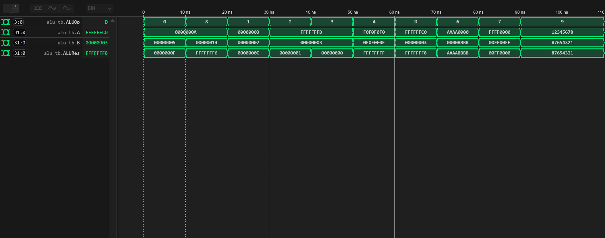
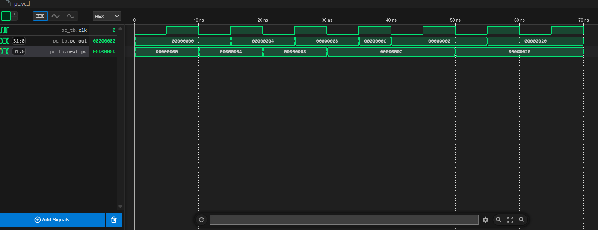
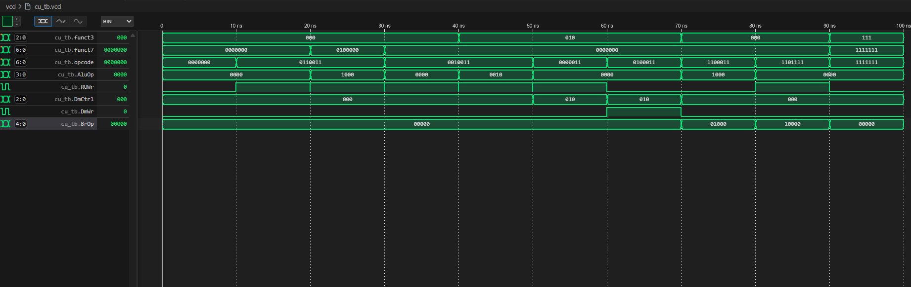
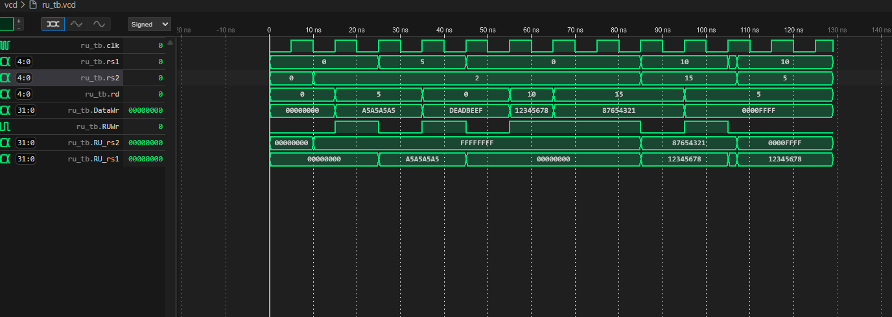
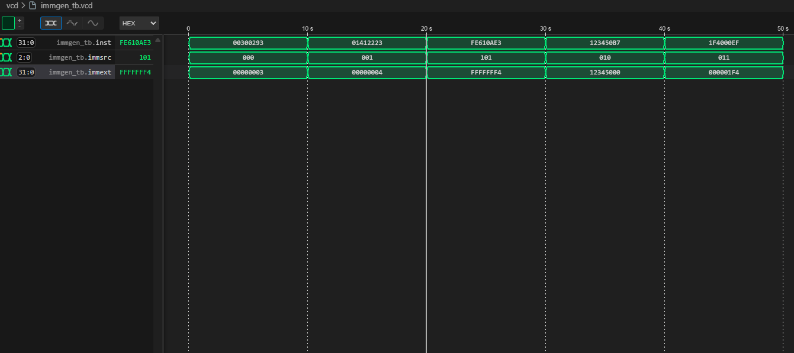
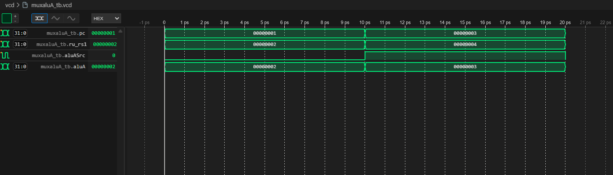
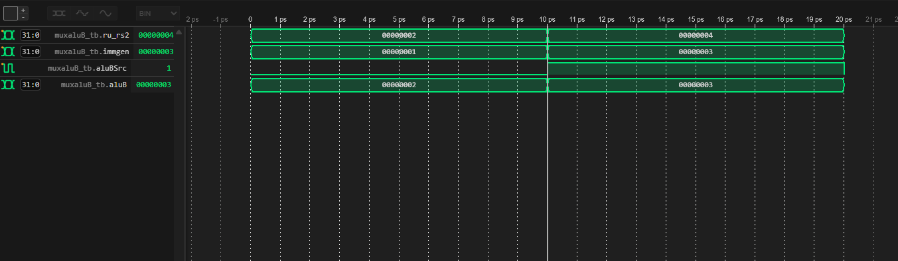
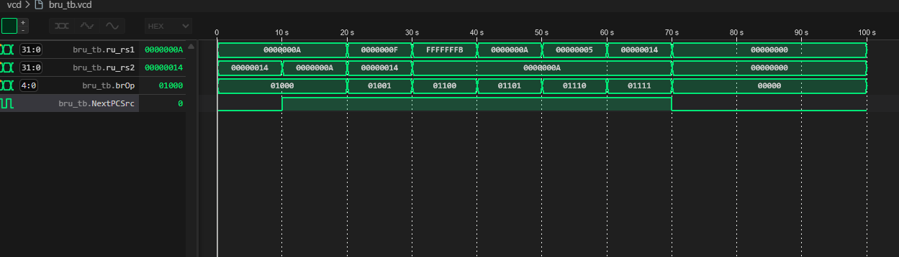
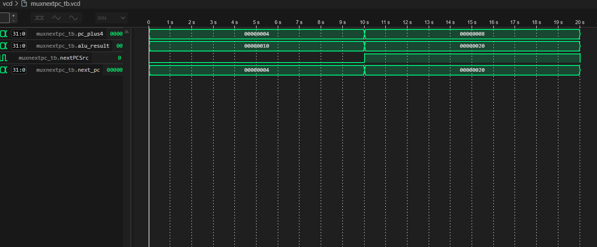
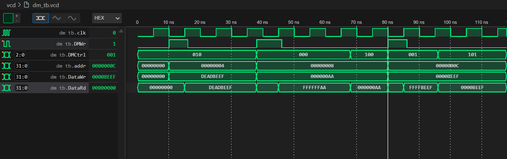

# 🧠 Informe de Observaciones, Dificultades, Soluciones y Conclusiones

**Laboratorio 1 – Implementación del Procesador Monociclo RISC-V (RV32I)**  
Arquitectura de Computadores – Universidad Tecnológica de Pereira

---

## 📘 Introducción

En este documento se registrarán de manera progresiva las observaciones, dificultades encontradas, soluciones aplicadas y conclusiones obtenidas durante el desarrollo del procesador monociclo RISC-V (RV32I).  
El propósito es mantener un registro detallado del proceso de construcción, verificación y análisis de cada módulo, siguiendo la metodología planteada en el laboratorio.

---

## 🎯 Objetivos

- Implementar los módulos fundamentales del procesador monociclo (ALU, Banco de registros, Unidad de control, Memorias, etc.).
- Verificar su funcionamiento mediante testbench en **Icarus Verilog**.
- Analizar las señales de simulación en **WaveTrace (VSCode)**.
- Documentar de forma progresiva las dificultades y soluciones durante el desarrollo.

---

## 📝 Registro de Desarrollo

### 1️⃣ ALU (Arithmetic Logic Unit)

Se implementó la Unidad Aritmético-Lógica como módulo combinacional con entradas de 32 bits (`A`, `B`) y selector de operación de 4 bits (`ALUOp`). Soporta 11 operaciones: suma, resta, desplazamientos (lógicos y aritmético), comparaciones (signed/unsigned) y operaciones lógicas (AND, OR, XOR). Se desarrolló un testbench (`alu_tb.sv`) que verifica todas las operaciones con casos representativos incluyendo números positivos, negativos y operaciones de bits. Todas las pruebas fueron exitosas.

**Resultado del testbench:**

---

### 2️⃣ Program Counter (PC)

Se implementó el Program Counter como módulo secuencial que almacena la dirección de la instrucción actual. Utiliza un flip-flop de 32 bits con señal de reloj (`clk`) y reset asíncrono (`reset`). La entrada `next_pc` permite actualizar la dirección en cada ciclo de reloj. Al activar reset, el PC se reinicia a 0x00000000. Se desarrolló un testbench (`pc_tb.sv`) que verifica la actualización secuencial del PC, la funcionalidad de reset y la carga de diferentes direcciones. Todas las pruebas fueron exitosas.

**Resultado del testbench:**

---

### 3️⃣ Sumador (Sum)

Se implementó un módulo combinacional que incrementa en 4 la dirección del Program Counter (PC). Este módulo es esencial para avanzar a la siguiente instrucción en el flujo de ejecución del procesador.

El diseño utiliza una operación combinacional simple para sumar 4 a la entrada `pc_in` y producir la salida `pc_out`.

#### 🧪 Testbench del Sumador

Se desarrolló un testbench (`sum_tb.sv`) que verifica:

- ✅ Incremento correcto de la dirección del PC en 4.
- ✅ Manejo de valores límite, como `0xFFFFFFFC`.

**Resultado del testbench:**

---

### 4️⃣ Unidad de Control (Control Unit)

La Unidad de Control fue diseñada como un módulo combinacional encargado de decodificar las instrucciones RISC-V y generar todas las señales de control necesarias para el procesador monociclo. Se analizaron los diferentes formatos de instrucción (R, I, S, B, U, J) y se implementó una lógica basada en un bloque `case` sobre el campo `opcode`, complementada con los campos `funct3` y `funct7` para distinguir operaciones específicas. Para cada tipo de instrucción, se asignan valores concretos a las señales de control: escritura en registros (`RUWr`), selección de inmediato (`ImmSrc`), fuentes de la ALU (`AluAsrc`, `AluBsrc`), operación de salto (`BrOp`), operación de la ALU (`AluOp`), control de memoria de datos (`DmWr`, `DmCtrl`) y fuente de datos para escritura en registros (`RUDataWrSrc`). El diseño se apoyó en tablas de verdad y documentación oficial del set de instrucciones RV32I, asegurando que cada instrucción activa únicamente las señales requeridas para su ejecución.

#### 🧪 Testbench

El testbench se elaboró para verificar el funcionamiento de la Unidad de Control bajo diferentes escenarios representativos. Se instanció el módulo y se inicializaron las señales de entrada (`opcode`, `funct3`, `funct7`). Para cada tipo de instrucción relevante, se asignaron los valores correspondientes y se dejó un retardo para observar la respuesta. Se utilizaron `$display` para mostrar en consola los valores de las señales de salida más importantes, facilitando la depuración y el análisis directo. Además, se generó un archivo VCD con `$dumpfile` y `$dumpvars` para visualizar las ondas en WaveTrace. El testbench cubre instrucciones R-Type (ADD, SUB), I-Type (ADDI, SLTI), Load (LW), Store (SW), Branch (BEQ), Jump (JAL) y un caso inválido, permitiendo comprobar la correcta decodificación y activación de señales en cada caso.

**Resultado del testbench:**

---

### 5️⃣ Unidad de Registros (Register Unit)

El banco de registros (RU) implementa los 32 registros de propósito general de la arquitectura RISC-V, cada uno de 32 bits. Su función principal es almacenar los operandos y resultados de las instrucciones. El registro x0 está protegido y siempre contiene el valor 0, mientras que el registro x2 (stack pointer) se inicializa en el valor más alto de memoria para facilitar la gestión de la pila.

**Funcionamiento:**

- **Lectura asíncrona:** Los valores de los registros fuente (`rs1` y `rs2`) pueden consultarse en cualquier momento, sin depender del reloj. Esto permite que el procesador lea los operandos de manera inmediata.
- **Escritura sincronizada:** La escritura en el registro destino (`rd`) ocurre únicamente en el flanco de subida del reloj (`posedge clk`) y si la señal de control `RUWr` está activa. Es fundamental que los datos (`DataWr`) y el número de registro destino (`rd`) estén listos antes del flanco de reloj para que la escritura sea exitosa.
- **Protección de x0:** Si se intenta escribir en el registro x0, el módulo lo ignora y x0 permanece en cero, cumpliendo la especificación RISC-V.

#### 🧪 Testbench

El testbench (`ru_tb.sv`) verifica el funcionamiento del banco de registros mediante pruebas exhaustivas y representativas:

- **Prueba 1:** Lectura asíncrona de x0 y x2 (stack pointer), comprobando los valores iniciales.
- **Prueba 2:** Escritura sincronizada en x5, verificando que el valor se almacena correctamente tras el flanco de reloj.
- **Prueba 3:** Protección de x0, intentando escribir en x0 y comprobando que permanece en cero.
- **Prueba 4:** Escrituras múltiples en registros distintos (x10 y x15) en ciclos consecutivos, validando que cada escritura ocurre en el flanco de reloj y que la lectura simultánea es correcta.
- **Prueba 5:** Sobrescritura de un registro (x5), asegurando que el nuevo valor reemplaza al anterior.
- **Prueba 6:** Lectura asíncrona de múltiples registros, mostrando que los valores escritos persisten y pueden leerse en cualquier momento.

Cada prueba utiliza `$display` para mostrar los resultados en consola y genera un archivo VCD para análisis de ondas en WaveTrace. Se comprobó que la escritura solo ocurre en el flanco de subida del reloj y que los datos deben estar estables antes de ese instante para garantizar el funcionamiento correcto. La protección del registro x0 y la inicialización del stack pointer también fueron validadas.

#### ⚠️ Dificultad: sincronización con posedge en la Register Unit

Durante la verificación del banco de registros, se presentó una dificultad en la **Prueba 4** del testbench: al realizar escrituras consecutivas en diferentes registros, los valores no se almacenaban correctamente. El problema era que los datos y el número de registro destino (`rd`) deben estar estables **antes** del flanco de subida del reloj (`posedge clk`), ya que la escritura es sincronizada. Si se actualizan las señales justo en el flanco, la escritura puede fallar o no reflejar el valor esperado.

**Solución:**
Se ajustó el testbench para asegurar que, antes de cada `@(posedge clk)`, los valores de `rd`, `DataWr` y `RUWr` estuvieran correctamente asignados y estables. Se agregaron los posedge necesarios entre cada escritura, permitiendo que el módulo registre los datos en el ciclo de reloj adecuado. Así, las escrituras múltiples y la lectura simultánea funcionaron correctamente, validando el comportamiento esperado del banco de registros.

**Resultado del testbench:**

---

### 6️⃣ Immediate Generator (immgen)

El módulo `immgen` se encarga de extraer y extender el campo inmediato de las instrucciones RISC-V, adaptándose a los diferentes formatos (I, S, B, U, J). Recibe la instrucción completa y una señal de control (`immsrc`) que indica el tipo de inmediato a generar. Para cada formato, se seleccionan y reordenan los bits correspondientes, aplicando extensión de signo cuando es necesario.

**Funcionamiento:**

- Para instrucciones tipo I, S, B, U y J, el módulo genera el inmediato extendido a 32 bits según la codificación RISC-V.
- Utiliza asignaciones continuas (`wire`) para cada tipo de inmediato y un bloque `always_comb` para seleccionar el valor final según `immsrc`.

#### 🧪 Testbench

El testbench (`immgen_tb.sv`) verifica el funcionamiento del generador de inmediatos con instrucciones representativas de cada formato:

- I-Type: addi x5, x0, 3
- S-Type: sw x5, 20(x2)
- B-Type: beq x2, x6, -16
- U-Type: lui x10, 0x12345
- J-Type: jal x1, 0x1F4

Para cada caso, se asigna la instrucción codificada y el tipo de inmediato, comprobando que el valor generado coincide con el esperado. Se utiliza `$display` para mostrar los resultados y se genera un archivo VCD para análisis de ondas.

#### ⚠️ Dificultad: extracción de inmediato en S-Type

Durante la verificación, se detectó que la prueba S-Type no generaba el valor esperado. El problema se debía a la codificación incorrecta del inmediato en la instrucción de prueba, lo que provocaba que los bits extraídos no correspondieran a 20. La solución fue ajustar la instrucción en el testbench para que los bits [31:25] y [11:7] representaran correctamente el valor 20, permitiendo que el módulo extrajera el inmediato correcto.

**Resultado del testbench:**

---

### 7️⃣ Multiplexores para la ALU (muxaluA y muxaluB)

Para dotar de flexibilidad a la ALU y permitir la ejecución de diferentes tipos de instrucciones, se implementaron dos módulos multiplexores:

- **muxaluA:** Selecciona la primera entrada de la ALU entre el valor del Program Counter (`pc`) y el registro fuente 1 (`RU[rs1]`). El control se realiza mediante la señal `aluASrc` proveniente de la Unidad de Control.
- **muxaluB:** Selecciona la segunda entrada de la ALU entre el valor generado por el módulo de inmediatos (`immgen`) y el registro fuente 2 (`RU[rs2]`). El control se realiza mediante la señal `aluBSrc` de la Unidad de Control.

Ambos módulos se diseñaron como multiplexores simples de 2 a 1, utilizando bloques `always_comb` y una señal de selección. Esto permite que la ALU reciba los operandos adecuados según el tipo de instrucción (por ejemplo, operaciones aritméticas entre registros, operaciones con inmediatos, cálculos de direcciones, etc.).

#### 🧪 Testbench

Se desarrollaron testbenches independientes para cada multiplexor (`muxaluA_tb.sv` y `muxaluB_tb.sv`), verificando los dos casos posibles de selección:

- Cuando la señal de control es 0, se selecciona el valor del registro correspondiente.
- Cuando la señal de control es 1, se selecciona el valor alternativo (PC o inmediato).

En cada prueba se asignan valores distintos a las entradas y se comprueba que la salida del multiplexor corresponde al valor esperado. Se utiliza `$display` para mostrar el resultado y se genera un archivo VCD para análisis de ondas.

**Resultado de los testbenches:**

---

### 8️⃣ Branch Unit (BRU)

La Branch Unit (`bru`) es responsable de evaluar las condiciones de salto en las instrucciones de control de flujo (branch) del procesador RISC-V. Recibe como entradas los valores de los registros fuente (`ru_rs1` y `ru_rs2`) y una señal de control (`brOp`) que indica el tipo de comparación a realizar (igualdad, desigualdad, menor, mayor o igual, versiones signed y unsigned).

Según el valor de `brOp`, la unidad compara los operandos y genera la señal `NextPCSrc`, que indica si el salto debe realizarse o no. Esto permite que el Program Counter seleccione la siguiente dirección de instrucción correctamente, según el resultado de la comparación.

**Funcionamiento:**

- Soporta todos los tipos de branch definidos en RISC-V: BEQ, BNE, BLT, BGE, BLTU, BGEU.
- Utiliza un bloque `always_comb` y un `case` para seleccionar la operación de comparación adecuada.
- La salida `NextPCSrc` se activa (1) si la condición de salto se cumple, y permanece en 0 en caso contrario.

#### 🧪 Testbench

El testbench (`bru_tb.sv`) verifica el funcionamiento de la Branch Unit con pruebas para cada tipo de comparación:

- BEQ: Igualdad
- BNE: Desigualdad
- BLT: Menor que (signed)
- BGE: Mayor o igual que (signed)
- BLTU: Menor que (unsigned)
- BGEU: Mayor o igual que (unsigned)
- No branch: Sin salto

Para cada caso, se asignan valores representativos a los registros y la señal de control, comprobando que la salida `NextPCSrc` corresponde al resultado esperado. Se utiliza `$display` para mostrar los resultados y se genera un archivo VCD para análisis de ondas.

**Resultado del testbench:**

---

### 9️⃣ Multiplexor para la Siguiente Instrucción (muxnextpc)

El módulo `muxnextpc` es el encargado de seleccionar la dirección de la siguiente instrucción que debe cargar el Program Counter (PC). Recibe dos posibles direcciones:

- El valor de `PC + 4`, que corresponde a la ejecución secuencial normal.
- El resultado de la ALU, que puede ser una dirección de salto calculada (por ejemplo, en instrucciones de branch o jump).

La selección entre estas dos opciones se realiza mediante la señal de control `NextPCSrc`, generada por la Branch Unit (`bru`). Si `NextPCSrc` es 0, el PC avanza de forma secuencial; si es 1, se toma la dirección calculada por la ALU.

**Funcionamiento:**

- Implementado como un multiplexor 2 a 1, usando un bloque `always_comb` y la señal de selección.
- Permite que el procesador ejecute saltos y cambios de flujo de manera eficiente y controlada.

#### 🧪 Testbench

El testbench (`muxnextpc_tb.sv`) verifica ambos casos de selección:

- Cuando `NextPCSrc` es 0, la salida corresponde a `PC + 4`.
- Cuando `NextPCSrc` es 1, la salida corresponde al resultado de la ALU.

En cada prueba se asignan valores distintos a las entradas y se comprueba que la salida del multiplexor corresponde al valor esperado. Se utiliza `$display` para mostrar el resultado y se genera un archivo VCD para análisis de ondas.

**Resultado del testbench:**

---

### 🔟 Data Memory (Memoria de Datos)

El módulo `dm` implementa la memoria de datos del procesador monociclo RISC-V32I, permitiendo operaciones de lectura y escritura en diferentes tamaños: byte, halfword y word, tanto en versiones signadas como no signadas. La memoria se organiza como un arreglo de 1 KiB (1024 bytes), accesible mediante una dirección de 32 bits.

**Funcionamiento:**

- La lectura es combinacional, permitiendo obtener el dato solicitado en cualquier momento según el tipo de acceso (`DMCtrl`).
- La escritura es sincronizada, ocurriendo únicamente en el flanco de subida del reloj (`clk`) cuando la señal de escritura (`DMWr`) está activa. Esto asegura la integridad de los datos y evita condiciones de carrera.
- Se soportan los modos LB, LH, LW, LBU, LHU y sus equivalentes de escritura (SB, SH, SW).

#### 🧪 Testbench

El testbench (`dm_tb.sv`) verifica el funcionamiento de la memoria de datos con pruebas para cada tipo de acceso:

- Escritura y lectura de palabra completa (SW/LW)
- Escritura y lectura de byte (SB/LB/LBU)
- Escritura y lectura de halfword (SH/LHU)

Se asignan valores representativos y se comprueba que la salida corresponde al valor esperado. Se utiliza `$display` para mostrar los resultados y se genera un archivo VCD para análisis de ondas.

#### ⚠️ Dificultades y consideraciones

Durante la implementación se presentaron dos dificultades principales:

- **Sincronización con el reloj:** Es fundamental que la escritura ocurra en el flanco de subida del reloj. Si se intenta leer inmediatamente después de escribir, sin esperar el siguiente ciclo, pueden aparecer valores indeterminados (`x`). La solución fue agregar retardos adecuados en el testbench para garantizar que la lectura ocurra después de la escritura efectiva.
- **Inicialización de la memoria:** Para evitar valores indeterminados al inicio de la simulación, se inicializó toda la memoria a cero en un bloque `initial`.

Estas consideraciones aseguran que el módulo sea compatible tanto con simuladores como con herramientas de síntesis como Quartus.

**Resultado del testbench:**

---

---
